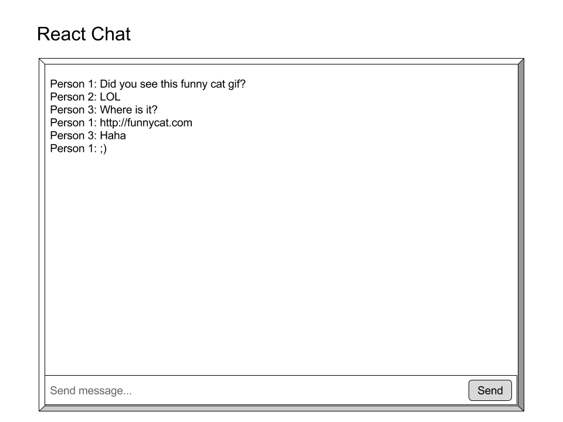

# Pair programming exercise: React chat

> A foreword to Windows users: please make sure you are using an LTS version of Node (the latest LTS release is 4.4.7). Verify that you are using the correct version with `node --version`.

## Goal

The goal of this exercise is to create a simple chat application using React and WebSockets. Using components, you will implement functionality to enter a room, send messages, receive messages, and change rooms.

## Part 0: A WebSockets Reference

> **Note:** Give this a quick overview and refer back to this section later to determine what events to emit and when!

Below is a reference to all WebSockets events that you will be listening for and emitting for the purpose of chat. A WebSockets chat server has already been set up for you on the same server that is serving up your React application. 

<sub>**Send** indicates a WebSockets event that goes from Client (your browser, running a React application) to Server (your Node application, running a WebSockets server). **Receive** denotes a WebSockets event that goes from Server to Client.</sub>

* **Send:** `username` - This must be the first event emitted after a successful socket connection; no other events will work unless a username has been emitted and stored.
	* _Emit_ with a String that represents your username
	* _Will emit_ `errorMessage` with "No username!" if the username is invalid. Duplicate usernames are permissible.
* **Send:** `room` - This event will be used for both connecting to a room initially and changing between rooms.
	* _Emit_ with a String that represents the room you want to join
	* _Will emit_ `errorMessage` with "No room!" if you do not pass in anything to the `room` event	
	* _Will emit_ `errorMessage` with "Username not set!" if no username has been set yet.
* **Send:** `message` - This event will be used for sending messages to the server to be sent to the rest of the room.
	* _Emit_ with a String that represents the contents of the message you want to send.
	* **Note:** You must handle displaying your own messages that you send - your own messages _will not_ be broadcast back to you.
* **Receive:** `message` - This event will be used for all messages sent - you will only receive this event for messages sent in the current room you are in (set by sending a `room` event).
	* _Will emit_ an **Object** (important!) that has a property `username` indicating who the message is coming from and property `content` containing the message's text contents
		* **Example:**
		
		```
		{
			"username": "Ethan",
			"content": "Did you commit today?"
		}
		```
		* **Note:** All user join events will automatically broadcast a message coming from "System" that looks like "_a user_ has joined". You can test if your `message` receiving handlers are working by having multiple "users" join a room on different tabs of your browser.
* **Receive:** `errorMessage` - This event will be sent from the server for any errors. Listen for this event on the client to handle errors such as "Username not set!"
	* _Will emit_ back with any error messages for the client, could be any one of the following (their meanings speak for themselves):
		* "No username!"
		* "No room!"
		* "Username not set!"
		* "No rooms joined!"
	* _Tip:_ If you want to continually ask your user for a username until they enter a valid (non-empty) username, check if the `errorMessage` data you get back is equal to "No username!" and prompt them again if so. Don't forget to emit the `username` event back to the socket!


Remember: all WebSockets events are received like the following:

```
this.socket.on('eventName', function(dataFromEvent) {
	// Do something with dataFromEvent
})
```

and all WebSockets events are sent like the following:

```
this.socket.emit('eventName', 'dataToSend');
```

Note that we already handled connections for you and stored the socket object on `this.state` - the root state of the `<App />` component.

## Part 1: Chat component - `client/index.js`

For Part 1, you will be working with one chat room, sending and receiving messages from a group of users that are connected to a single room. The end result of **Part 1** should look something like the following:



Start by implementing some basics that we have given you function definitions for (replace `YOUR CODE HERE`): 

1. Create a property on the return object of `getInitialState` called `roomName` with a default name of a room - because they have not yet selected a room, "No room selected!" is fine.
2. Get and store a username from the user in the callback of the socket's `connect` event - you may use `prompt()` to get input from the user in an easy way!
3. Determine how you will handle errors by filling in the callback function of the socket's `errorMessage` event. `alert()`ing potential errors is sufficient here.

Next, we'll write our logic for sending and receiving messages in a `<ChatRoom />` React component. Notice in **`client/index.js`** that there is already a button setup with an `onClick` event of the `join` function, passing in "Party Place." 

> **Note:** Since we're only dealing with one room at a time for now, calling `join` with only "Party Place" for now is fine - when we design a `<ChatRoomSelector />` component in the next step, we will need to change things.

Change the `join` function so that when it is called, it does not simply log the passed-in room name (`room`), but also calls `setState` to change the room name as a part of the `state` of the top-level `<App />` component - you named this in the first step with `getInitialState` as `roomName`. Remember that we always modify state with the `setState` function!

Next, create a component called `<ChatRoom />` that handles all the logic for sending and receiving messages in its [component lifecycle](https://facebook.github.io/react/docs/component-specs.html) methods. We will pass two props into `ChatRoom` when we render it:

* `socket` - pass `this.state.socket` (from `<App />`) down to its child `<ChatRoom />` so that it can communicate on the same WebSockets connection
* `name` - pass `this.state.roomName` (or whatever name you've set for storing the room name in the state from the previous step, from `<App />`) down to its child `<ChatRoom />` so that the component knows what room name to join and display when it is rendered into the `<App />`.

Now, use the lifecycle methods you learned to change state and the display of the `<ChatRoom />` over time. You may try to design these yourself, or you can follow the spec below:

### Lifecycle spec for `<ChatRoom />` component - `client/index.js`
* `getInitialState` (called before a component gets rendered to set its state object)
	* Return an object with the following:
		* A property (suggestion: `message`) representing a message that the user is typing - we will use this later, but for now, set it to empty string!
		* A property (suggestion: `messages`) representing all messages sent and received in the room - we will also use this later, but for now, it could be an empty array!
* `componentDidMount` (called right before a component "mounts" or gets rendered)
	* On `componentDidMount`, set your event handlers for displaying messages using `this.props.socket` - the socket object that you passed in as a property to the `<ChatRoom />` component. Handle this the same way we attached event handlers for `connect` and `errorMessage` events above, but call `.on` on `this.props.socket` instead. Your event handlers should call `this.setState` and update an array of message objects that you are storing.
	* _Tip:_ Try `alert()`ing your messages before you create the rest of your `<ChatRoom />` component to test that your socket event handler is working properly. You can send a message by emitting!
* `componentWillReceiveProps` (called when receiving new props - i.e., a change of the `name` prop passed in from `<App />`)
	* On `componentWillReceiveProps`, you want to check if there has been a change to `this.props.name` - this means that we will have switched rooms (in this part, `componentWillReceiveProps` will have little functional effect since we only have one room, but it will be used in the next step).
	* Remember that `componentWillReceiveProps` takes a parameter (`nextProps`) that represents the new props that have been passed into `<ChatRoom />`. Compare `nextProps.name` (the new name prop) to `this.props.name` (the old name prop) and if they are different, call `setState` with an object that sets your `messages` array to empty again and your `name` to the new name prop.
	
	<sub>**Read more about `componentWillReceiveProps` with examples and documention [here](https://facebook.github.io/react/docs/component-specs.html#updating-componentwillreceiveprops)**.</sub>
* `render` (called to display the component)
	* On `render`, you will be handling the display of both messages and a text input to send messages through. Below are the basics that you want to handle:
		* An array of message elements on the page that are created through the array of message objects that you stored earlier - you may choose to display these as list items, table rows, or paragraphs.
		* A form element that contains the following:
			* A text input element with an `onChange` property that **takes a function that you create** to update the property of `state` that you set as an empty string in `getInitialState` (representing a message that the user is typing). This text input element should also have a `value` property of that same `state` property.
			* A submit input element or button that says "Send" to submit the form it is in
		* The form element should also be given an `onSubmit` property that **takes a function that you create** to clear the property of state we used for the message that the user is typing (setting it to empty string) and **emit** a `message` event as specified in **Step 0: A WebSockets Reference**. This function should also update the messages array in your state with the message you just sent, since we will not receive `message` events for messages that we sent.
		
> ⚠️ **Warning:** Do not use `this.state.messages.push` (or the equivalent for the array that is storing your messages) to put new messages in your state. Remember, we always call `setState` to modify state rather than changing `this.state` itself. Instead of pushing directly, you could push to a temporary array and then set the temporary array to the new `messages` inside of `setState` or use [`.concat(/* an item you want to put in */)`](https://developer.mozilla.org/en-US/docs/Web/JavaScript/Reference/Global_Objects/Array/concat) to return you an array with a new item at the end.
			


## Part 2: Multi-room chat - `client/index.js`

Next, we'll implement multiple rooms with a separate component (on the same level as `<ChatRoom />`) called `<ChatRoomSelector />` that will allow us to change which room we are currently chatting with. The end result will look like the following:


This time, it's up to you to design this component from the ground-up using the below Lifecycle spec. 

### Lifecycle spec for `<ChatRoomSelector />` component - `client/index.js`


- Add required `name` prop for `ChatRoom`
- `componentDidMount()` on ChatRoom join channel
- `componentWillUnmount()` disconnects/leaves channel

## Challenge: "User is typing"


